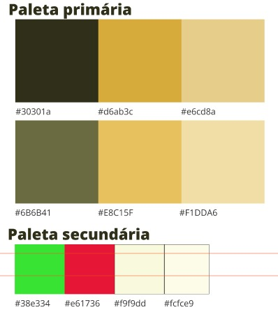

# Colonymon Frontend

Esse é um projeto  [Next.js](https://nextjs.org/) criado com [`create-next-app`](https://github.com/vercel/next.js/tree/canary/packages/create-next-app).

## Iniciando o projeto

Primeiro, instale as dependências:
```bash
yarn
```

Depois, execute o servidor de desenvolvimento:
```bash
yarn dev
```

Abra [http://localhost:8081](http://localhost:8081) com o seu navegador para ver o resultado.

## Design

### Color Palette



Fonte: [`Open Sans`](https://fonts.google.com/specimen/Open+Sans)

## Aprendendo Next.js

Para saber mais sobre Next.js, dê uma olhada nos seguintes recursos:

- [Next.js Documentation](https://nextjs.org/docs) - aprenda sobre os recursos e API do Next.js.
- [Learn Next.js](https://nextjs.org/learn) - um tutorial interativo Next.js.

## Deploy no Vercel

O deploy do projeto foi feito no [Vercel](https://vercel.com/new?utm_medium=default-template&filter=next.js&utm_source=create-next-app&utm_campaign=create-next-app-readme).

## Configure Git User & Email

```sh
# In your colonymon-frontend
git config user.name "Gêdhean Alves"
git config user.email "gedhean.dev@gmail.com"
```

## Referências

- [Apexcharts - Docs](https://apexcharts.com/docs/installation/);
- [Material UI - Docs](https://mui.com/material-ui/);
- [Figma - Colonymon](https://www.figma.com/file/qGtKAliahzKQSORfMneIyR/Material-3-Design-Kit-(Community)?node-id=11%3A1833&t=V8STLabeXCI5Ghp5-0);
- [Project - Docs](https://gedheans-organization.gitbook.io/colonymon/).


## Licença de uso

[MIT](https://choosealicense.com/licenses/mit/).